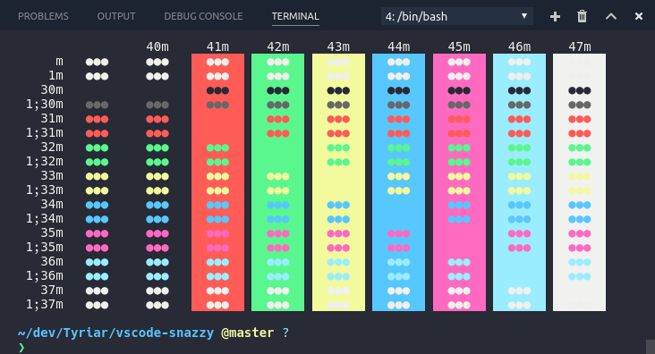

# vscode-snazzy

> Elegant [Terminal](https://en.m.wikipedia.org/wiki/Terminal_(macOS)) theme with bright colors

## Install

- Copy the contents of `snazzy.json` into your VS Code settings.json file.
- If you want to use snazzy's standard background instead of your theme background, uncomment the `"terminal.background"` line.

## Related

- [hyper-snazzy](https://github.com/sindresorhus/hyper-snazzy) - Hyper version
- [iterm2-snazzy](https://github.com/sindresorhus/iterm2-snazzy) - iTerm2 version
- [konsole-snazzy](https://github.com/miedzinski/konsole-snazzy) - Konsole version
- [terminal-snazzy](https://github.com/sindresorhus/terminal-snazzy) - Terminal version
